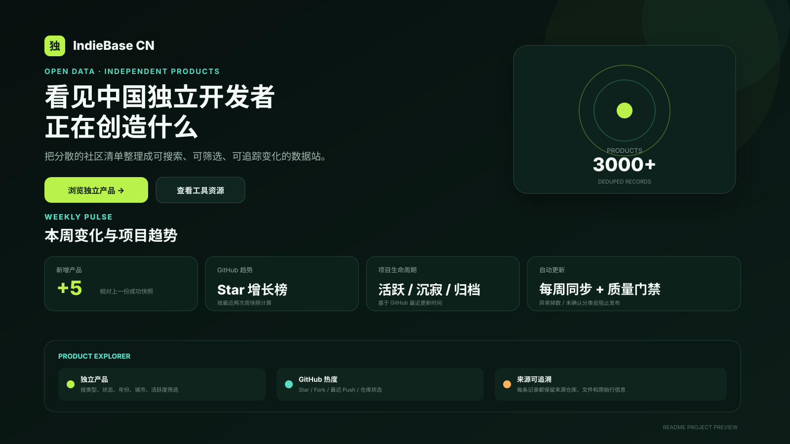

<div align="center">

# IndieBase CN

**中国独立开发者产品观察站**

把散落在社区里的独立产品、开发工具和 GitHub 项目整理成一个可以搜索、筛选、看趋势、追踪变化的网站。

[](https://github.com/Fzkls/chinese-indie-products/actions/workflows/site.yml)
[](https://fzkls.github.io/chinese-indie-products/)
[](.github/workflows/site.yml)

</div>

---

## 🌐 在线访问

### **👉 [https://fzkls.github.io/chinese-indie-products/](https://fzkls.github.io/chinese-indie-products/)**

如果你只是想看看有哪些独立产品、最近新增了什么、哪些 GitHub 项目还在持续维护，直接打开上面的链接即可，不需要安装任何东西。



## 这个项目是做什么的？

网上已经有不少“中国独立开发者 / 独立产品”的社区清单，但大多数都是 Markdown 长列表。

IndieBase CN 做的事情很简单：

> **把这些分散的清单持续同步下来，整理成结构化数据，再做成一个更容易浏览和观察变化的网站。**

它不是一个新的投稿社区，也不是自己重新维护一份产品名单，而是在现有公开数据源之上增加：

| 能力 | 你能看到什么 |
| --- | --- |
| 产品搜索 | 按产品名、开发者、描述、城市等搜索 |
| 多条件筛选 | 产品类型、运行状态、年份、城市、GitHub 活跃度 |
| 本周变化 | 相比上一份成功快照新收录、移除、变化了什么 |
| GitHub 趋势 | Star / Fork 变化、最近 Push、项目是否还活跃 |
| 项目生命周期 | 持续活跃、近期活跃、一年内维护、长期未更新、已归档 |
| 产品分类 | 自动整理到 AI、开发工具、内容、设计、教育、游戏等领域 |
| 来源追溯 | 每条数据都能看到来自哪个仓库、哪个文件、哪一行 |

## 页面里有什么？

### 独立产品

这是主数据集，可以直接浏览和搜索独立开发者做过的产品。

每条记录会尽量保留：

- 产品名称和介绍
- 开发者
- 产品地址
- 时间和城市
- 当前状态
- 产品分类
- GitHub 仓库信息
- 原始数据来源

### 本周变化

网站会保存上一份成功同步的数据，并和当前数据做对比。

所以你可以直接看到：

```text
本周新收录
本周移除
已有产品信息变化
```

这里的“新增”指：

> **当前快照里存在，但上一份成功快照里不存在。**

它不一定等于“这个产品本周刚发布”。

例如上游重新恢复了一批历史数据时，也会被识别成一次快照新增。

### GitHub 趋势

如果产品本身直接关联公开 GitHub 仓库，系统会额外记录：

```text
Stars
Forks
最近 Push 时间
是否 Archived
主要语言
License
```

每周还会保存一份轻量历史快照，因此可以逐渐观察：

```text
最近一周 Star 增长
Fork 增长
项目是否还在持续维护
项目是否长期没有更新
```

GitHub 历史数据从 IndieBase CN 开始观察项目之后才会积累，**不会反推或伪造过去的 Star 历史**。

## 数据从哪里来？

目前主要同步这些公开项目：

| 数据源 | 用途 |
| --- | --- |
| [1c7/chinese-independent-developer](https://github.com/1c7/chinese-independent-developer) | 独立开发者产品主数据 |
| `.github/pages/README-Programmer-Edition.md` | 程序员 / 开发者工具 |
| `.github/pages/README-Game.md` | 游戏产品 |
| `.github/pages/README-Archive.md` | 2018–2024 历史归档 |
| [XiaomingX/1000-chinese-independent-developer-plus](https://github.com/XiaomingX/1000-chinese-independent-developer-plus) | 补充独立产品 |
| [yaolifeng0629/Awesome-independent-tools](https://github.com/yaolifeng0629/Awesome-independent-tools) | 独立开发相关工具资源 |

原始内容的维护权和署名仍属于对应上游仓库及贡献者。

## 自动更新是怎么跑的？

项目使用 GitHub Actions 自动维护数据。

```text
公开上游仓库
      ↓
同步原始数据
      ↓
解析 + 去重
      ↓
检查来源是否正常
      ↓
清理失效分类记录
      ↓
重新分类
      ↓
刷新 GitHub 信息和周快照
      ↓
测试 + 数据质量检查
      ↓
生成静态网站
      ↓
自动提交最新数据
      ↓
发布 GitHub Pages
```

默认每周会自动执行一次，同时支持手动运行。

核心入口统一为：

```bash
npm run refresh:data
```

## 为什么有时候 GitHub Actions 会主动失败？

这是故意设计的。

这个项目宁愿暂时不发布新数据，也不希望在上游格式变化时静默产生错误结果。

目前有几类重要保护：

| 情况 | 处理方式 |
| --- | --- |
| 必需上游地址失效 | 停止发布 |
| 临时网络错误 / 5xx / 429 | 自动重试 |
| 产品或工具数量突然下降超过 15% | 停止发布，等待人工确认 |
| 新产品暂时无法可靠分类 | 自动复核后进入 Other，不阻断发布；只有成批异常才停止发布 |
| Taxonomy override 已失效 | 自动清理 |
| GitHub 单个仓库失效 | 标记 unavailable，不把它当成 0 Star |

比如新出现一个系统暂时无法判断分类的产品时，会先进入自动复核层：能复用规则就自动归类；仍缺少足够证据时会保留为 `Other` 并留下复核元数据，但不会因为单条边界产品让整站停止更新。

只有当 `Other` 突然批量增加、超过保护阈值时，CI 才会认为可能是分类器整体回归并阻止发布。

## 数据质量

生成后的质量信息在：

**[data/quality-report.json](data/quality-report.json)**

这里会记录：

- 产品 / 工具数量
- 缺失字段
- 重复记录
- 数据源健康状态
- 产品与工具之间的 URL 重叠
- 解析 warning
- 数据安全门禁信息

产品和工具始终是两个独立数据集，不会因为 URL 相同就跨数据集合并。

## 主要数据文件

| 文件 | 内容 |
| --- | --- |
| `data/products.json` | 独立产品结构化数据 |
| `data/tools.json` | 独立开发工具数据 |
| `data/product-taxonomy.json` | 产品语义分类结果 |
| `data/taxonomy-overrides.json` | 明确人工确认过的分类 |
| `data/github-repositories.json` | 当前 GitHub 仓库信息 |
| `data/github-history.json` | 每周 GitHub Star / Fork 历史快照 |
| `data/weekly-changes.json` | 当前数据相对上一份成功快照的变化 |
| `data/quality-report.json` | 数据质量与来源健康报告 |

## 本地运行

要求 Node.js 20+。

只想在本地看看页面，可以直接使用仓库里的示例数据：

```bash
npm run sync:data -- --fixtures
npm run verify

python3 -m http.server 4173 -d dist
```

然后打开：

```text
http://localhost:4173
```

如果要同步真实上游并刷新 GitHub 数据：

```bash
export GITHUB_TOKEN=你的 GitHub Token
npm run refresh:data
npm run verify
```

常用命令：

| 命令 | 作用 |
| --- | --- |
| `npm run sync:data` | 同步产品 / 工具，并计算本周变化 |
| `npm run sync:taxonomy` | 重新生成产品分类 |
| `npm run sync:github` | 更新 GitHub 仓库数据和历史快照 |
| `npm run refresh:data` | 一次完成完整数据刷新 |
| `npm run taxonomy:doctor` | 检查失效的人工分类记录 |
| `npm run taxonomy:prune` | 清理失效人工分类记录 |
| `npm test` | 跑自动测试 |
| `npm run verify` | 完整校验并构建网站 |

## 项目结构

```text
.
├── .github/workflows/        # 自动同步和发布
├── data/                     # 生成后的结构化数据
├── fixtures/                 # 本地测试 / 示例数据
├── scripts/
│   ├── lib/                  # 解析、分类等核心逻辑
│   ├── sync-data.mjs         # 上游数据同步
│   ├── sync-taxonomy.mjs     # 分类生成
│   ├── sync-github.mjs       # GitHub 数据同步
│   └── build.mjs             # 静态站构建
├── src/                      # 页面脚本和样式
├── tests/                    # 自动测试
├── index.html
└── README.md
```

## 数据边界

这些数据来自社区公开维护的清单，因此：

> **它可以用来观察独立开发产品、项目类型和公开 GitHub 活跃度，但不能代表“中国独立开发者总体规模”。**

产品是否仍在运营、开发者所在地、描述文字等信息，也可能因为上游没有及时更新而滞后。

所以做分析时，建议同时看：

```text
数据生成时间
原始来源
GitHub 最近更新时间
```

## 贡献

如果发现数据解析错误、重复项目、分类不准确或上游路径发生变化，可以直接提交 Issue / Pull Request。

新增数据源时，最好同时说明：

```text
来源仓库
具体文件
解析规则
数据授权 / 署名要求
```

这样后续自动同步才能长期稳定运行。

---

<div align="center">

**IndieBase CN · 持续观察中国独立开发者正在创造什么**

### [打开网站 →](https://fzkls.github.io/chinese-indie-products/)

</div>
